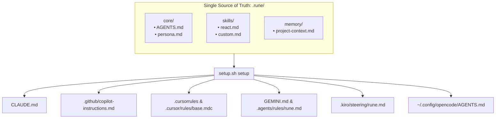

<div align="center">


<br/><br/>

[](https://github.com/bhargava562/rune/stargazers)
[](https://github.com/bhargava562/rune/network/members)
[](LICENSE)
[](https://www.gnu.org/software/bash/)
[](https://github.com/bhargava562/rune/pulls)

<br/>

**The missing setup layer for AI coding tools.**

*One command. Every tool configured. From one source of truth.*

</div>

---

## The problem

Six AI coding tools. Six config file formats. Zero shared memory.

Without config files, every tool starts blank in every session — with no knowledge of your coding style, project conventions, or development stack. Setting them up manually takes hours and they drift apart the moment anything changes.

---

## What rune does

Rune compiles your configuration from a single source of truth.



Every config file gets the same professional engineering persona — senior engineer communication style, behavior rules, tool-specific instructions — merged and written automatically.

---

## Quick start

Run in any project directory:

```bash
bash <(curl -fsSL https://raw.githubusercontent.com/bhargava562/rune/main/scripts/setup.sh) setup
```

**Want `rune` as a global command?**

```bash
curl -fsSL https://raw.githubusercontent.com/bhargava562/rune/main/install.sh | bash
```

---

## Architectural Design & Directory State

When you run `rune setup`, it builds a structured configuration hierarchy inside your workspace.

### Workspace File Hierarchy

```text
your-project/
├── .rune/
│   ├── core/                  ← Base rules injected from upstream templates (Gitignored)
│   │   ├── AGENTS.md          ← Core agent behavior & code quality rules
│   │   └── persona.md         ← Direct, senior-engineer communication style guidelines
│   ├── skills/                ← Installed framework patterns or custom developer rules
│   │   ├── README.md          ← Extension onboarding blueprint
│   │   └── react.md           ← Remote skill files downloaded from registry
│   └── memory/
│       └── project-context.md ← Persistent shared brain state tracking architectural decisions
├── .gitignore                 ← Automatically updated to prevent local configs from being committed
├── CLAUDE.md                  ← Claude Code entrypoint (Generated)
├── GEMINI.md                  ← Antigravity CLI global entrypoint (Generated)
├── .cursorrules               ← Legacy Cursor workspace entrypoint (Generated)
├── .cursor/
│   └── rules/
│       └── base.mdc           ← Cursor Scoped Rule Engine definition (Generated)
├── .github/
│   └── copilot-instructions.md← GitHub Copilot Copilot Chat profile configuration (Generated)
├── .agents/
│   └── rules/
│       └── rune.md            ← Google Antigravity tool-scoped behavioral steering (Generated)
└── .kiro/
    └── steering/
        └── rune.md            ← Kiro steering blueprint file with strict frontmatter (Generated)
```

### Deterministic Merging Workflow

Each generated configuration file is built sequentially by compounding three distinct Markdown layers:

1. **Behavioral Base Layer** (`.rune/core/AGENTS.md`): Dictates file handling safety checks, error message formats, and testing mandates.
2. **Personality Style Layer** (`.rune/core/persona.md`): Instructs the AI agent to converse like a direct and objective senior software engineer.
3. **Tool-Specific Adaptation Layer**: Merges dedicated operational specifications unique to how that specific agent reads file buffers or executes platform sub-processes (e.g., slash commands for Claude Code, markdown steering frontmatter for Kiro).

---

## Command Line Interface (CLI) Reference

The setup logic is orchestrated through `scripts/setup.sh` (exposed globally as `rune`).

### `rune setup`
Initializes or reconfigures an AI workspace.

* **Execution Flow:**
  1. **Directory Input:** Requests a target project directory (defaults to current directory).
  2. **Platform Detection:** Identifies host OS platform (`linux`, `mac`, `windows`) via `uname -s`.
  3. **Connectivity Check:** Tests internet connectivity to remote raw GitHub assets via `curl`.
  4. **Tool Selection:** Prompts user for a space-separated list of IDE/CLI tools to configure (or `all`).
  5. **Skill Selection:** Prompts for instant package skill installs (e.g., `react`).
  6. **Core Generation:** Downloads core templates, creates `.rune/` directory structure, generates base markdown rules, and updates `.gitignore`.
  7. **Ecosystem Prompting:** Evaluates optional ecosystem dependencies (`graphify`, `caveman`).
  8. **Tool Generation:** Fetches adapter templates and merges layers into tool-specific configuration formats.

### `rune list`
Queries the remote upstream structural index (`scripts/registry.txt`) and parses available ecosystem extensions using a streaming `while read` pattern. Outputs standard padded rows displaying the available shorthand token name alongside the authenticated remote download endpoint destination.

### `rune install <skills...>`
Downloads one or more specialized extension files directly into the active `.rune/skills/` directory.

* **Security Validation Check:** Validates incoming URLs against a hard-coded domain whitelist: `https://raw.githubusercontent.com/*`. Any untrusted endpoints are instantly blocked from entering local files.

---

## Extending & Adding Skills End-to-End

`rune` allows you to inject tailored organizational rules (for a specific programming language, framework, or internal library) without altering core templates or upstream tracking.

### Local Framework Extensions

To introduce project-specific boundaries, add a custom `.md` file into `.rune/skills/`. For instance, to ensure all Python operations strictly maintain high async compliance, construct the following file:

📁 **`.rune/skills/python.md`**

```markdown
## Python Domain Standards
- Always use async functions for network-bound operations.
- Enforce strict snake_case naming conventions for functions and variables.
- Never use raw print() debugging lines — explicitly invoke the internal `logging` wrapper instead.
```

Once added, executing `rune setup` re-triggers file assembly, automatically integrating your custom overrides into all your tools' root configurations.

### Integrating a Brand New AI Tool Adapter

To expand `rune` to support a new AI coding tool, follow this three-step lifecycle:

1. **Build a dedicated configuration file adapter template:** Create `templates/adapters/newtool.md` outlining tool-specific token optimizations or interaction strategies.
2. **Append case block architecture:** Insert a matching tracking criteria target within the core file compilation switch loop located inside `scripts/setup.sh`:
   ```bash
   newtool)
     curl -fsSL "$REPO_URL/templates/adapters/newtool.md" -o "$TMP_DIR/adapter_newtool.md" 2>/dev/null
     {
       cat "$CORE/AGENTS.md"
       echo ""
       cat "$CORE/persona.md"
       echo ""
       [ -s "$TMP_DIR/adapter_newtool.md" ] && cat "$TMP_DIR/adapter_newtool.md"
       echo ""
       echo "## Workspace Context"
       echo "Read .rune/memory/project-context.md before writing code."
       echo "Update the ADR section after architectural decisions."
     } > "$WORKSPACE/.newtoolconfig"
     echo "  ✓ .newtoolconfig written"
     ;;
   ```
3. **Register the capability string:** Add the custom keyword string directly into the `AVAILABLE_TOOLS` space-separated environment array inside `scripts/setup.sh` (around line 220).

---

## Ecosystem Integrations

`rune` provides optional integrations with performance tuning tools during the workspace bootstrap process:

### Graphify

A structural mapping dependency tool that allows agents to parse complex cross-module dependencies across directories. If accepted during setup, it injects an active system tool notification block directly into `.rune/core/AGENTS.md`:

```markdown
### Core System Tool: Graphify
This system is configured with Graphify. If you need to evaluate file hierarchies or map cross-module structural dependencies, execute the shell command `graphify` locally.
```

### Caveman Token Optimizer

An aggressive caching utility that intercepts LLM output streams, trimming redundant output logs by 65–75% to conserve context windows and reduce token costs. Setup manages dependency checks requiring Node.js 18+ and routes custom deployment steps based on whether it detects a Unix-like pipeline or native Windows PowerShell execution paths.

---

## Master Prompt for AI Engineering

Use this prompt when starting a chat session with an AI coding assistant inside this repository to ensure it respects the `rune` design patterns and file constraints.

```markdown
System Prompt for Codebase Engineering:
You are a senior systems engineer acting as a core contributor to 'rune'. You are working within a repository configured with strict structural conventions. Review and follow these instructions exactly before providing modifications or text updates:

1. Repository Mapping & State Context:
   - Root configuration workflows reside in `.github/workflows/lint.yml` enforcing ShellCheck properties with exceptions allowed for SC2164 and SC1091.
   - Global script installers exist inside install.sh routing platform variables to `/usr/local/bin` or fallback `$HOME/.local/bin`.
   - Core template builders populate `templates/AGENTS.md`, `templates/persona.md`, and adapters folder paths.
   - Core pipeline setup routes within scripts/setup.sh.

2. Implementation Constraints:
   - This codebase is purely written in modular Bash scripting. Maintain hyper-strict POSIX compatibility bounds where appropriate or ensure explicit fallback coverage for standard environments using Git Bash on Windows.
   - Never implement features using heavy dependencies. Rely on lightweight Unix utilities such as native bash flags, grep, awk, and curl streams.
   - Never remove existing inline comments. When rewriting functional logic blocks, clearly comment code revisions.

3. Execution Goals:
   - When asked to add tool profiles, follow the tool-adapter blueprint: write the template file, register the capability keyword array, and attach the compilation handler logic within the evaluation engine case switch block inside scripts/setup.sh.
```

---

## Contributing

Open an issue before starting work on large changes.

```bash
git checkout -b feat/new-adapter
# add templates/adapters/newtool.md
# add case block in scripts/setup.sh
# open PR
```

---

## License

MIT — [Bhargava A](https://bhargavaa.vercel.app)

[](https://linkedin.com/in/bhargavaa1)
[](https://github.com/bhargava562)
